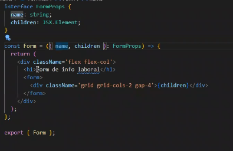
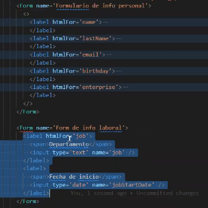
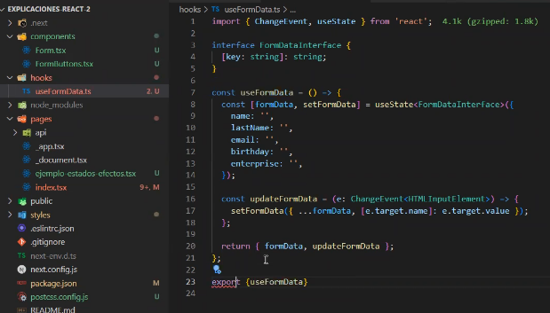
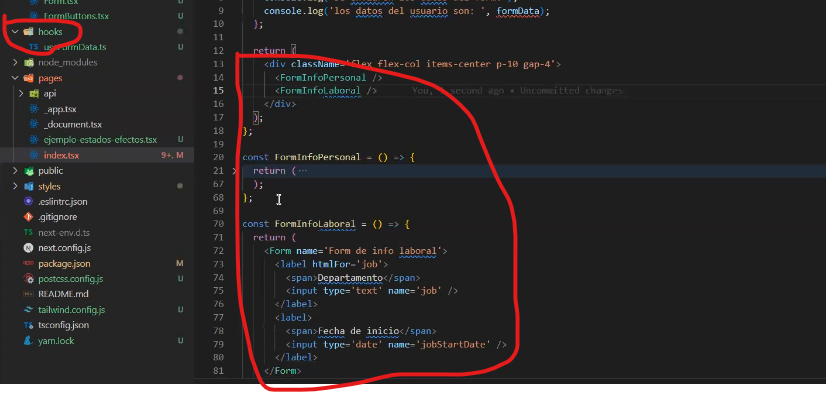
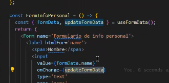

### Ingenieria_Web

## 14/03/2023

# Resumen de **estados** y **efectos**.

Los estados sirven para definir variables dentro de react, son un hook de react
Los hooks de react son funciones que empiezan con la palabra use, ejemplos: const [counter, setCounter] = useState<number>(0); para llamarlo desde el html seria: {counter} para crear una funcion que lo modifique seria: const increaseCounter = () -> {setCounter(counter+1)};
Los efectos son otro hook de react que permite escuchar si una variable esta cambiando y tomar decisiones con respecto a eso un ejemplo seria useEffect(() -> { if(counter <=10){setError('counter menor o igual a 10');} }, [counter])

el enfoque web hace que sea un paradigma de programacion orientada a eventos
Los eventos en html siempre empiezan con la palabra on, un ejemplo seria 
<input value = {formData.Name}
onChange={
    (e) -> {setFormData({...FormaData, [e.target.name]: e.target.Value});}
} type = 'text' name= 'name' placeholder='mi Nombre' />
esta me modica el valor de una variable cada vez que se modifica el input
otro eventos pueden ser onclick, onFocus, onError, onKeyDown, onKeyUp, onMouseUp, **onBlur** este es muyb importante y se ejecuta una vez el usuario dejo de tener focus en el input .
Cuando tenemos botones dentro de un form podemos hacer uso del evento onSubmit nos permite controlar cuando el usuario hace click en el boton tipo submit

# Reutilizacion de codigo

Cuando necesito hacer uso de estructuras de datos muy repetitivas, lo ideal es trabajar de una manera mas agil y estandarizada. para eso podremos usar componentes, para los cuales creamos una nueva carpeta en la cual iran los nuevos componentes con formato .tsx y luego pa invocarlo seria <nombreComponente />

**NOTA:** cuando se crea un archivo de tsx mediante un funcion y un export, el return solo puede contener una etiqueta, por lo cual si hay varias deberian ponerlas dentro una vacia <> o un **
**

Para pasar los inputs como parametros se crea un interface formProps con las variables y sus tipos y luego las ponemos en las etiquetas correspondientes  

**hooks**

react tambien nos permite crear nuestros propios hooks con el fin de reutilizar codigo, para esto creamos una carpeta hooks y creaos un archivo con extension.ts ya que no va aretornar codigo html.

Se pueden crear hooks tanto de manera interna en la carpeta component como de manera externa en el codigo html.

y finalmente lo traemos directamente con el use

39:04

"" 16/03/2023

Primero identificacion de 
luego instal nextjs
instalamos tailwind 
Limpiamos cosas que no nos sirvan (pages, css ....)
preferiblemente instalar yarn (borramos package.lock y corremos yarn install)

nextconfig.js van las variables globales
packaje.json dependencias de nuestro proyecto
tsconfig.json nos permite transpilar el typescript y convertirlo a js
eslint.json nos permite configurar reglas de programacion para validar codigo https://eslint.org/
recomendacion utilizar las reglas de airbnb de eslint 
con yarn add -D eslint-config-airbnb eslint-config-airbnb-typescript eslint-config-prettier eslint-plugin-import eslint-plugin-jsx-a11y eslint-plugin-prettier eslint-plugin-react eslint-plugin-react-hooks eslint-plugin-typescript
el siguiente comando es para organizar el codigo detailwind con prettier
yarn add -D prettier prettier-plugin-tailwindcss

usar mediaquerys de tailwind para poder utilizar diferente layouts dependiendo del tamaño de la pantalla ya sea para mobile o desktop
por ejemplo para una pantalla chica quiero flex-col pero si la pantalla es grande le podemos poner en class lg:flex-row
esto me dice que una vez llegue a pantallas grandes
podemos poner los varios componentes para mobile o desktop y a determinado tamaño seleccionamos si uno esta oculto a no por ejemplo en el class poner md:hidden
para iconos utilizar react-icons 
en el html podemos tener operaciones ternarias teniendo un estado {valor?siVerdadero:siFalso}
para poder mostrar mensajes emergentes usaremos react-tostify
para mostrar una carga previa mientras llegan los datos podemos utilizar react-loading
otra libreria necesaria seria material ui tiene componentes de todo y son faciles de usar
